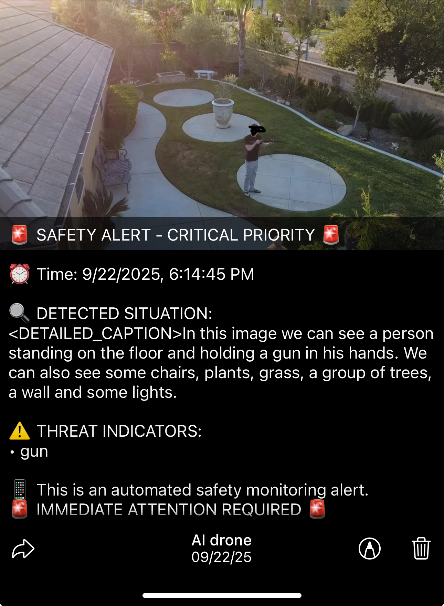

# AI-Powered Security Surveillance System

A real-time RTMP streaming server with advanced AI threat detection, powered by NVIDIA's Florence-2 model. The system monitors video streams, analyzes captured frames for security threats, and provides intelligent notifications with threat severity assessment.

## 🚨 Live Safety Alert Demo

<div align="center">



**Real-time AI threat detection in action** - Our system automatically identifies security threats and generates immediate safety alerts with detailed threat analysis, severity classification, and recommended actions.

</div>

---

### 🔍 Alert Interface Breakdown

The safety alert interface showcases our comprehensive threat detection system:

| Component                 | Feature            | Description                                                                  |
| ------------------------- | ------------------ | ---------------------------------------------------------------------------- |
| 🚨 **Priority Level**     | Critical Priority  | Immediate attention alerts with visual indicators                            |
| ⏰ **Timestamp**          | Precise Timing     | Exact date/time for incident tracking and forensics                          |
| 🔍 **Situation Analysis** | Detailed Caption   | AI-powered scene description with object and threat identification           |
| ⚠️ **Threat Indicators**  | Smart Detection    | Automatic identification of weapons, suspicious behavior, and security risks |
| 📱 **Mobile Interface**   | Real-time Alerts   | Push notifications delivered instantly to security personnel                 |
| 🎯 **Action Required**    | Immediate Response | Clear guidance on required actions and escalation procedures                 |

### 📊 Key Alert Features Demonstrated

- **🎯 Precision Detection**: Identifies specific threats (weapon detection in this example)
- **📍 Location Awareness**: Pinpoints exact location and context of the threat
- **⚡ Real-time Processing**: Instant analysis and notification delivery
- **📋 Comprehensive Logging**: Detailed incident reports for security review
- **🔔 Multi-channel Alerts**: Supports various notification methods (mobile, Telegram, etc.)

---

## AI Threat Detection Features

- **Real-time Security Monitoring**: Continuously analyzes video frames from RTMP streams
- **Dual-Layer AI Analysis**: Combines pattern matching with advanced AI contextual analysis
- **Multi-Level Threat Classification**: CRITICAL, HIGH, MEDIUM, LOW threat severity levels
- **Intelligent Notifications**: Automated Telegram alerts with threat summaries
- **Confidence Scoring**: Provides threat confidence percentages and recommended actions
- **Customizable Sensitivity**: Configurable threat detection thresholds

## How AI Threat Detection Works

The system employs a sophisticated two-stage analysis approach:

### Stage 1: Pattern Recognition

The `threatDetector.js` analyzes image classifications using predefined security patterns:

- **CRITICAL Threats**: Weapons, violence, break-ins, fires, explosions
- **HIGH Threats**: Unauthorized persons, suspicious behavior, masked individuals
- **MEDIUM Threats**: Unusual objects, after-hours activity, rapid movements
- **LOW Threats**: Minor anomalies, unexpected movement patterns

### Stage 2: AI Contextual Analysis

Advanced AI analysis using NVIDIA's Florence-2 model provides:

- Contextual understanding of the scene
- Behavioral pattern analysis
- Security-focused threat assessment
- Confidence scoring and reasoning

The system combines both analyses to provide accurate threat detection with minimal false positives.

## 📁 Project Structure

```
├── src/                    # Source code
│   ├── server.ts          # Main RTMP server (TypeScript)
│   ├── server.js          # Legacy JavaScript server
│   ├── threatDetector.js  # 🛡️ AI threat detection engine
│   ├── imageClassifier.ts # AI classification service (NVIDIA Florence-2)
│   ├── telegramNotifier.ts# Security alert notification service
│   └── site.html          # Web viewer interface
├── config/                # Configuration files
│   ├── config.js          # Main configuration (JavaScript)
│   └── config.py          # Python configuration (legacy)
├── data/                  # Runtime data (ignored by git)
│   ├── captured_frames/   # Video frame captures
│   └── classification_results/ # AI classification results
├── docs/                  # Documentation
│   └── README.md          # Detailed documentation
├── package.json           # Node.js dependencies and scripts
├── tsconfig.json          # TypeScript configuration
└── .gitignore             # Git ignore rules
```

## Quick Start

1. **Install dependencies**:

   ```bash
   npm install
   ```

2. **Configure API keys** in `config/config.js`

3. **Start the server**:

   ```bash
   npm start          # TypeScript version
   npm run start:js   # JavaScript version
   ```

4. **Stream to**: `rtmp://localhost:1935/live/{stream_key}`

## Threat Detection Configuration

### Sensitivity Levels

Configure threat detection sensitivity in `config/config.js`:

```javascript
threatDetection: {
  notificationThreshold: 3,  // MEDIUM and above (1-5 scale)
  detailedAnalysis: true,    // Enable AI contextual analysis
  timeBasedAnalysis: true    // Consider time-of-day factors
}
```

### Threat Severity Scale

- **5 - CRITICAL**: Immediate danger (weapons, violence, break-ins)
- **4 - HIGH**: Suspicious activity (unauthorized persons, climbing fences)
- **3 - MEDIUM**: Potential concern (loitering, unusual objects)
- **2 - LOW**: Minor anomaly (unexpected movement)
- **1 - NONE**: Normal activity

### Example Alert Output (As Shown Above)

Our system generates comprehensive safety alerts exactly like the one demonstrated in the image above:

```
🚨 SAFETY ALERT - CRITICAL PRIORITY 🚨

⏰ Time: 9/22/2025, 6:14:45 PM

🔍 DETECTED SITUATION:
In this image we can see a person standing on the floor and holding a
gun in his hands. We can also see some chairs, plants, grass, a group
of trees, a wall and some lights.

⚠️ THREAT INDICATORS:
• gun

📱 This is an automated safety monitoring alert.
🚨 IMMEDIATE ATTENTION REQUIRED 🚨

🤖 AI drone
📅 09/22/25
```

**Real-world deployment ready** - This exact alert format is delivered via Telegram, mobile push notifications, and web dashboard interfaces.

## Full Documentation

See [docs/README.md](docs/README.md) for complete setup instructions, configuration options, and usage examples.

## Security Features

### Real-time Monitoring

- **Frame Capture**: Automatically captures frames from RTMP streams at configurable intervals
- **Instant Analysis**: Each captured frame is immediately processed through the AI threat detection pipeline
- **Continuous Surveillance**: 24/7 monitoring with intelligent filtering to reduce noise

### Intelligent Notifications

- **Telegram Integration**: Real-time security alerts sent to configured Telegram channels
- **Threat Summaries**: Rich notifications including threat level, confidence, reasoning, and recommended actions
- **Threshold-based Filtering**: Only sends notifications for threats above configured severity levels

### Advanced AI Analysis

- **Multi-Modal Detection**: Combines visual analysis with contextual understanding
- **Pattern Recognition**: Detects suspicious behaviors, weapons, unauthorized access, and security breaches
- **Confidence Scoring**: Provides reliability metrics for each threat assessment
- **False Positive Reduction**: Advanced algorithms minimize unnecessary alerts

## Development

- `npm run dev` - Start with auto-reload
- `npm run build` - Compile TypeScript
- `npm run classify` - Test AI classification
- `npm run notify` - Test Telegram notifications
- `npm run test-threat` - Test threat detection system
- `npm run simulate` - Simulate security footage for testing

## Configuration

Key configuration files:

- `config/config.js` - Main server and AI settings
- `package.json` - Dependencies and scripts
- `tsconfig.json` - TypeScript compiler options

Data directories are automatically created and managed by the application.

## Technologies

- **NVIDIA Florence-2**: Advanced vision-language model for image understanding
- **Node Media Server**: High-performance RTMP streaming server
- **Telegram Bot API**: Real-time security notifications
- **TypeScript/Node.js**: Modern, type-safe backend development
- **Pattern Recognition**: Advanced regex-based threat pattern matching
- **AI Contextual Analysis**: Intelligent scene understanding and threat assessment

## Requirements

- **NVIDIA API Key**: Required for Florence-2 image classification
- **Telegram Bot Token**: For security alert notifications
- **Node.js 18+**: Runtime environment
- **RTMP Source**: Video stream (security camera, OBS, etc.)

## Use Cases

- **Security Surveillance**: Monitor restricted areas for unauthorized access
- **Perimeter Protection**: Detect fence climbing, break-ins, and intrusions
- **Violence Detection**: Identify fights, weapons, and dangerous situations
- **Property Monitoring**: Watch for vandalism, theft, and property damage
- **After-Hours Security**: Enhanced monitoring during off-business hours
